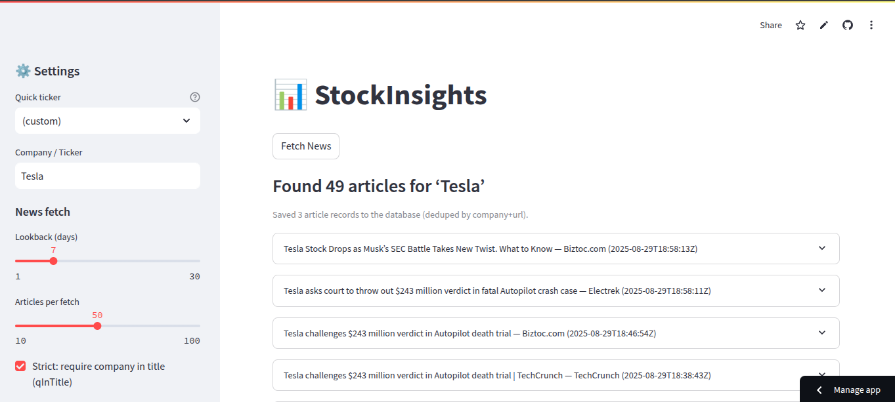
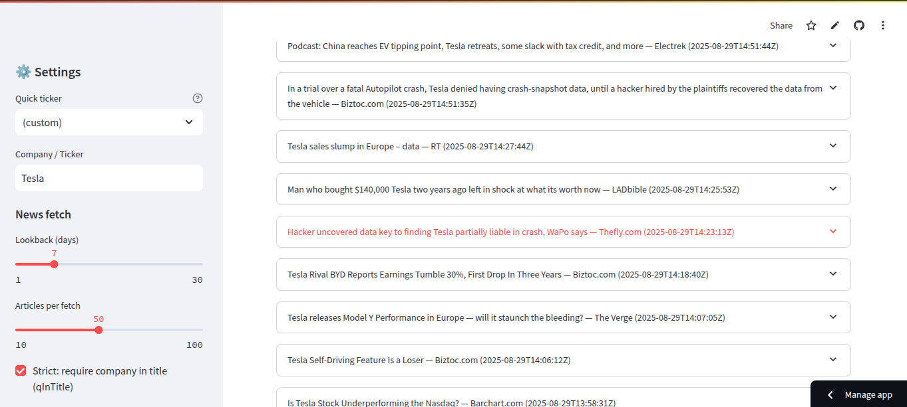
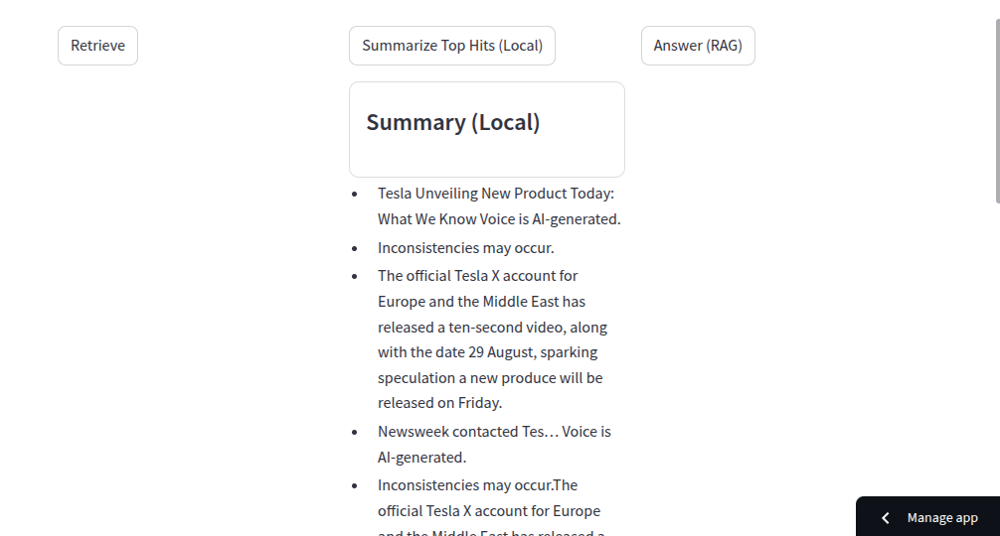
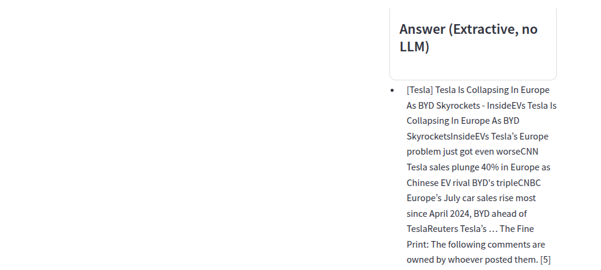
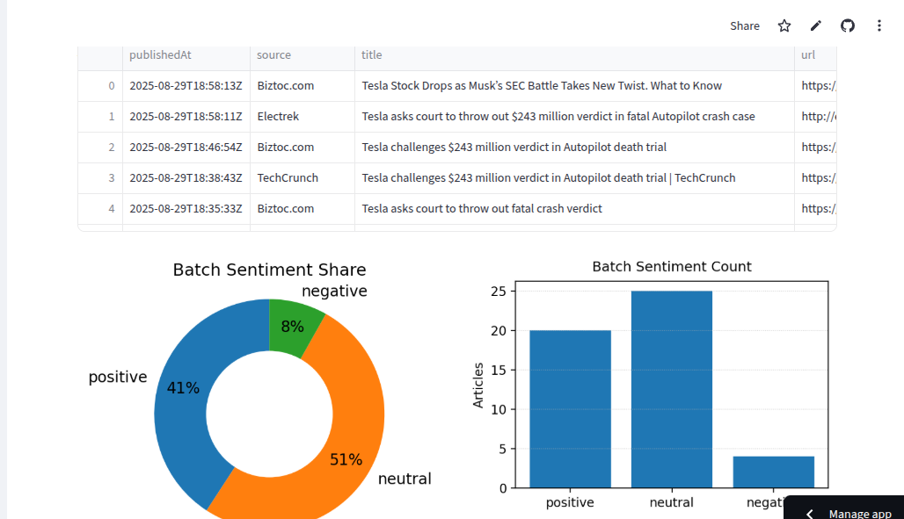
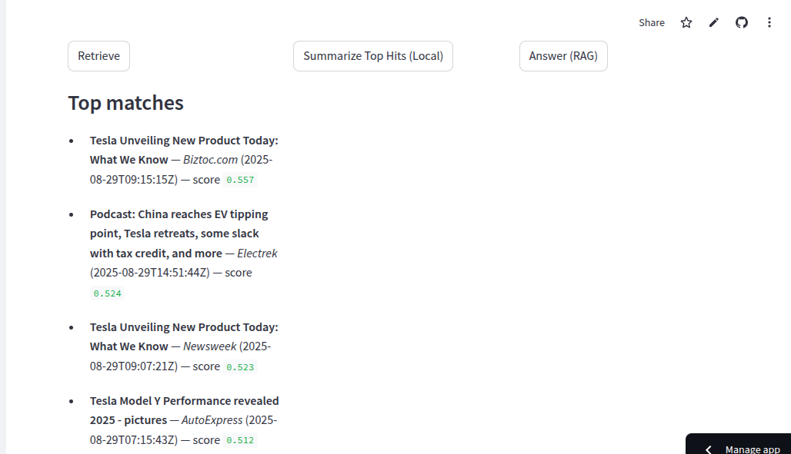

# 📊 StockInsights

**StockInsights** is an interactive Streamlit app for exploring financial news with **summarization**, **sentiment analysis**, and **retrieval-augmented generation (RAG)**.  

👉 Live demo: [StockInsights on Streamlit Cloud](https://stockinsights-cloud-9xwqbsyehpztp2mqehwr5t.streamlit.app/)


---
## 📸 Screenshots  

### 🖥️ User Interface (Homepage)  
  

### 🧪 Test / Evaluation Panel  
  

### 📝 Summarize Top Hits  
  

### 🤖 Answer (RAG)  
  

### 🧠 Sentiment Analysis  
  

### 🧠 Retrival 


## ✨ Features

- **📡 News Fetching**  
  Fetch the latest financial news using [NewsAPI](https://newsapi.org/).

- **📝 Summarization**  
  - **Local (desktop/server runs):**  
    Uses Hugging Face model [`sshleifer/distilbart-cnn-12-6`] for **abstractive summarization**.  
    (Produces fluent, paraphrased summaries, but requires more compute.)  
  - **Streamlit Cloud:**  
    Uses a lightweight **TF-IDF sentence ranking summarizer** (`scikit-learn` based, in `summarizer_local.py`).  
    (Resource-efficient and fast, but extractive.)  

- **🧠 Sentiment Analysis**  
  Financial sentiment classification with **FinBERT** (`ProsusAI/finbert`), returning *positive / neutral / negative*.  

- **🔍 RAG (Retrieval-Augmented Generation)**  
  - **Extractive (default, CPU-only):** Concise bullet points from retrieved news.  
  - **Optional LLM generation:**  
    - Can call **Ollama** (if installed locally).  
    - Can use a Hugging Face LLM via API key (e.g., Zephyr, Mistral, Gemma).  

- **🗄️ Vector Stores**  
  Supports:
  - **FAISS** (in-process, default)  
  - **ChromaDB** (local persistent)  
  - **Weaviate** (remote cluster)  

- **💾 Persistence**  
  Saves article metadata and sentiment results to **SQLite (`news_history.db`)**.  

- **📈 Evaluation**  
  - **Summarization:** ROUGE, BERTScore on CNN/DailyMail.  
  - **Sentiment:** Accuracy & F1 on Financial PhraseBank.  

---

## 📂 Folder Structure

```plaintext 
StockInsights/
│── app.py                # Main Streamlit app
│── requirements.txt      # Dependencies
│── .env.example          # Example env file (NEWSAPI_KEY, HF_MODEL_ID, etc.)
│
├── text_utils.py         # Text cleaning & chunking helpers
├── summarizer_local.py   # TF-IDF summarizer (used in Cloud)
├── sentiment.py          # FinBERT sentiment classifier
├── rag_llm.py            # RAG logic (extractive + optional Ollama/HF)
├── news_api.py           # NewsAPI fetch wrapper with retries
├── evaluate.py           # Offline evaluation (ROUGE, BERTScore, Accuracy, F1)
├── embed_store.py        # Vector store backends (FAISS, Chroma, Weaviate)
├── db.py                 # SQLite ORM (articles + sentiments)

```

## 👉Getting Started  

Follow these steps to run the project locally:  

### 1. Clone the repo

```bash
git clone https://github.com/your-username/stockinsights.git
cd stockinsights
```
### 2. Install dependencies
```bash
pip install -r requirements.txt
```

### 3. Environment setup
```bash
 Create a .env file:
 NEWSAPI_KEY=your_newsapi_key
 HF_MODEL_ID=sshleifer/distilbart-cnn-12-6   # for local abstractive summarization
 VECTOR_BACKEND=faiss
```
### 4. Run locally
```bash
streamlit run app.py
```
### Local Vs Cloud 
| Environment         | Summarizer                                                 | RAG Backends                                          |
| ------------------- | ---------------------------------------------------------- | ----------------------------------------------------- |
| **Local**           | Hugging Face `sshleifer/distilbart-cnn-12-6` (abstractive) | Extractive (CPU) or Generative via Ollama / HF API    |
| **Streamlit Cloud** | `scikit-learn` TF-IDF sentence ranking (extractive)        | Extractive default; Generative if HF API key provided |

### 🧪 Evaluation 

**Run offline benchmarks:**
```bash
# Summarization (ROUGE + BERTScore on CNN/DailyMail)
python evaluate.py --task summarization --split "test[:50]"

# Sentiment (Accuracy + F1 on Financial PhraseBank)
python evaluate.py --task sentiment --split "test[:200]"
```
### Example Workflows 

**1.Fetch News → retrieves latest company articles.**

**2.Summarize (Local or HF model) → bullet summaries or abstractive summary.**

**3.RAG Answer → Ask free-form questions about news.**

**4.Sentiment Analysis → visualize article polarity with pie & bar charts.**

## 📍 Deployment

Deployed on **Streamlit Cloud**:  
👉 [https://stockinsights-lsj32s7pd6qrvovwnu3hpt.streamlit.app/](https://stockinsights-lsj32s7pd6qrvovwnu3hpt.streamlit.app/)

---

## 🔌 Extensibility

- Swap vector backends (**faiss**, **chroma**, **weaviate**).  
- Plug in **Ollama** or **Hugging Face LLMs** for RAG generation.  
- Extend evaluation to custom datasets.  

---

## 📜 License

**MIT License** — feel free to fork and adapt.
---

##  Courtesy

Custom emoji/icons created by **Arpon Roy**  
- GitHub: [ArponRoy7](https://github.com/ArponRoy7)  
- LinkedIn: [Arpon Roy](https://www.linkedin.com/in/arpon-roy-b461321a8/)  


